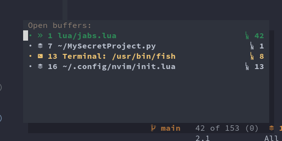
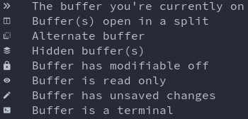

# JABS.nvim
**J**ust **A**nother **B**uffer **S**witcher is a minimal buffer switcher window for Neovim written in Lua. 

## How minimal? One command and one window minimal!

JABS shows exactly what you would expect to see with `:buffers` or `:ls`, but in a prettier and interactive way.



## Requirements

- Neovim version with Lua support (I only tested with v0.5 Nightly)
- A patched [nerd font](https://www.nerdfonts.com/) for the buffer icons

## Installation

You can install JABS with your plugin manager of choice. If you use `packer.nvim`, simply add to your plugin list:

``` lua
use 'matbme/JABS.nvim'
```

## Usage

As previously mentioned, JABS only has one command: `:JABSOpen`, which opens JABS' window.

By default, you can navigate between buffers with `h` and `j` as well as `<Tab>` and `<S-Tab>`, and jump to a buffer with `<CR>`. When switching buffers the window closes automatically, but it can also be closed with `<Esc>` or `q`.

### Color coding

- Your current visible buffers are shown in green
- The alternate buffer (`<C-^>`) is shown in yellow
- All other buffers are shown in white

### Symbols



## Future work

JABS is in its infancy and there's still a lot to be done. Here's the currently planned features:

- [ ] Switch to buffer by typing its number
- [ ] Preview buffer
- [ ] Close buffer with keymap
- [ ] Open buffer in split
- [ ] Sort modes (maybe visible and alternate on top)

Suggestions are always welcome 🙂!
